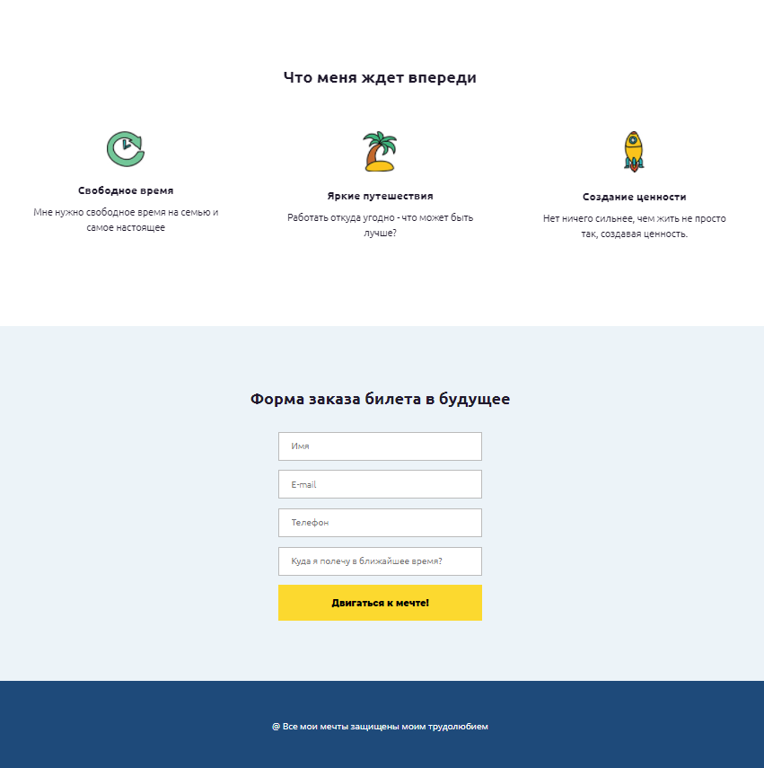

Адаптивный одностраничный сайт, разработанный мной в ходе прохождения курса WayUP Веб-верстальщик: начало

Инструкция по установке:
1) скачать проект на локальный компьютер и распаковать
2) запустить файл index.html

